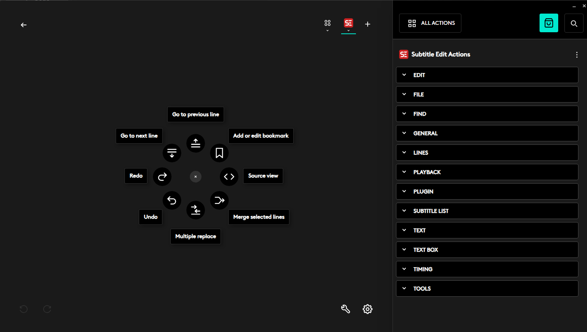
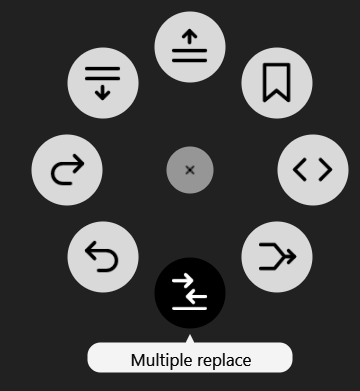
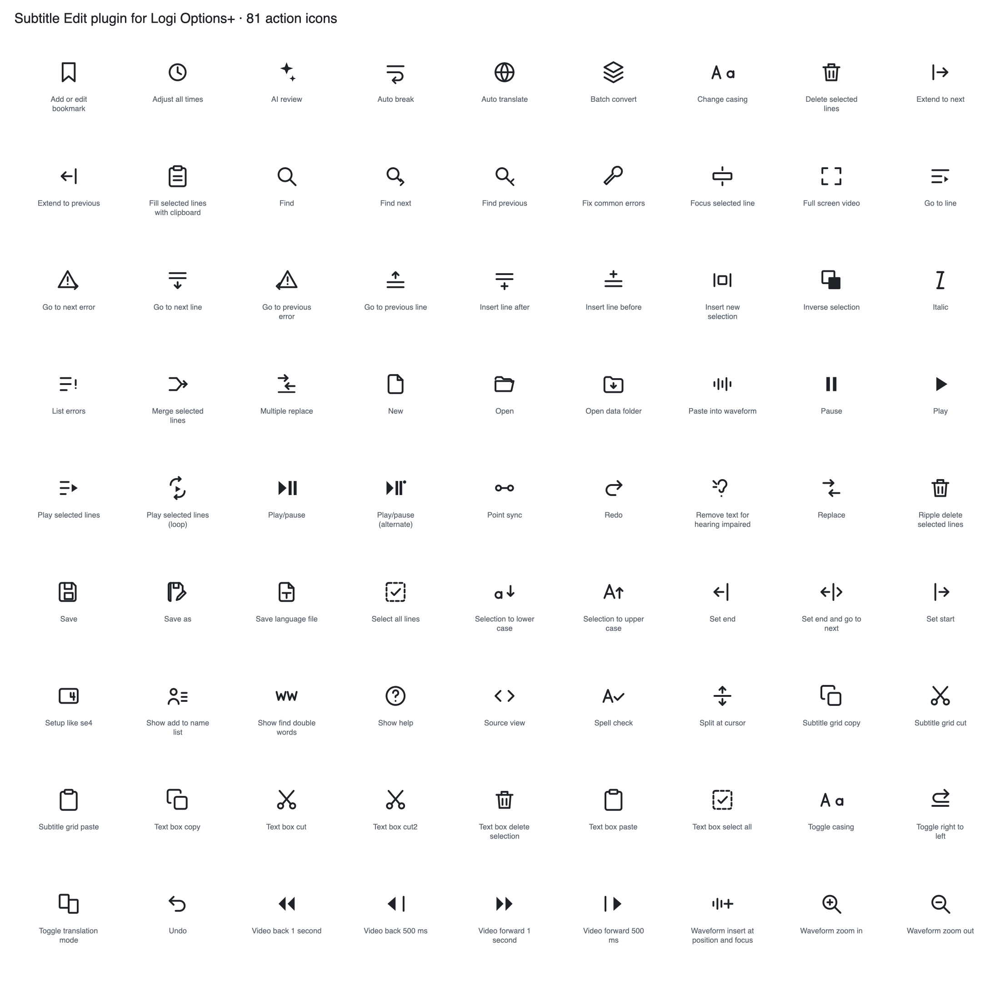

# Subtitle Edit plugin for Logi Options+

Control [Subtitle Edit](https://github.com/SubtitleEdit/subtitleedit) from a Logitech
device: MX Master (Actions Ring), MX Keys, or the MX Creative Console (buttons and dials).

Built on the [Logi Actions SDK](https://logitech.github.io/actions-sdk-docs/).
Runs on macOS and Windows from the same source.

## Screenshots

The Actions Ring with the plugin's actions, each with its own icon, and the grouped
action list in Options+:





## How it works

Subtitle Edit has no automation API, so the plugin drives it the way the SDK
recommends: by simulating the keyboard shortcuts Subtitle Edit already listens for.

The important detail is where those shortcuts come from. Subtitle Edit registers its
actions by name and stores the key bindings in the user's own `Settings.json`. The
keys are therefore whatever that user configured, and the primary modifier differs by
platform (`Win`, meaning Command, on macOS; `Ctrl` on Windows). Hard coding a key
combination would break for anyone who remapped a shortcut, and break again across
platforms.

So the plugin reads `Settings.json` at load, resolves each action to its real keys, and
builds one plugin action per shortcut. Remap something in Subtitle Edit and the plugin
follows. An action with no keys assigned never appears, because there is nothing to send.

Actions go to the focused application, so Subtitle Edit must be in front. The plugin is
linked to Subtitle Edit (bundle `dk.nikse.subtitleedit`, process `SubtitleEdit`), so
Options+ activates it automatically when Subtitle Edit comes forward.

### Where the settings are read from

1. `SUBTITLE_EDIT_SETTINGS`, if set.
2. Next to a running `SubtitleEdit` executable. Subtitle Edit treats itself as portable
   when it is not installed under Program Files and then keeps `Settings.json` beside
   its executable, which is how the Windows zip is normally run.
3. `%APPDATA%\Subtitle Edit\Settings.json` on Windows,
   `~/Library/Application Support/Subtitle Edit/Settings.json` on macOS.

This reads Subtitle Edit 5's `Settings.json`. The classic Subtitle Edit 4 keeps its
shortcuts in `Settings.xml`, in an unrelated format, and is not supported.

## Actions

Buttons are grouped as Playback, Timing, Lines, Text, File, Edit, Find and Tools.
Anything bound in Subtitle Edit but not named in `SeCatalog.cs` still appears, under its
Subtitle Edit control group, with a name derived from the action name.

Dials (MX Creative Console):

| Dial | Turn | Press |
| --- | --- | --- |
| Subtitle line | Previous / next line | Focus selected line |
| Video position | Back / forward 500 ms | Play or pause |
| Waveform zoom | Zoom out / in | none |
| Next error | Previous / next error | List errors |

`Reload shortcuts` re-reads `Settings.json` after you change a shortcut in Subtitle Edit.
New actions appear after the plugin itself reloads, since the action list is built at load.

## Building

Requires the .NET SDK and Logi Options+ (the build references `PluginApi.dll` from the
installed plugin service).

```bash
cd SubtitleEditPlugin
dotnet build                      # builds only
dotnet build -t:InstallPlugin     # also links it into the plugin service for testing
dotnet build -t:UninstallPlugin   # removes the link
```

After `InstallPlugin`, restart Logi Options+. A plain `dotnet build` never touches the
plugin service.

## Action symbols



Each action has its own icon in the Options+ picker. They are SVGs in
`SubtitleEditPlugin/package/actionsymbols/`, named after the action's full class name,
with the parameter name after a three underscore separator. Regenerate with:

```bash
python3 scripts/gen-action-symbols.py
```

The class is called `SeCommand` rather than something more descriptive because a tar
entry name cannot exceed 100 characters, and the longest Subtitle Edit action name
would otherwise push its symbol file past that.

## Languages

Action names are shown in the language of the Logitech software, in all 26 languages
Subtitle Edit ships. The translations are not written by hand: Subtitle Edit already
translates every one of these command names, and `ShortcutsMain.BuildCommandTranslations()`
says which language string belongs to which action, so they are lifted from there.

```bash
open "loupedeck://plugin/SubtitleEdit/xliff"     # service writes the neutral xliff
python3 scripts/gen-localization.py              # fills targets from Subtitle Edit
```

Group names, dial names and descriptions have no Subtitle Edit equivalent and stay in
English. Dutch resolves only 29 of 78 names because Subtitle Edit's own Dutch
translation is itself incomplete.

## Default profile

The package ships a default Actions Ring layout in `profiles/DefaultProfile72.lp5`
(device 72 is the Actions Ring). The plugin service uses it as the template when a
user first sets up the Subtitle Edit profile, so a fresh install starts with actions
in place rather than empty slots. It is a profile exported from Options+, not hand
built, and applies only to new profiles, never overwriting an existing one.

## Packaging

Two package formats, same contents, different consumers:

- `python3 scripts/pack-lplug4.py` writes the **tar** `.lplug4` for direct install
  (the local plugin service rejects a zip silently).
- `python3 scripts/pack-lplug4-zip.py` writes the **zip** `SubtitleEdit_<v>_marketplace.lplug4`
  for the Logi Marketplace upload (its validator unzips the file; a tar fails there).

The Marketplace re-serves a tar to end users, so only the tar reaches an installed device.

### Original packaging notes

```bash
cd SubtitleEditPlugin && dotnet build -c Release
python3 ../scripts/pack-lplug4.py
```

A `.lplug4` is an uncompressed POSIX ustar archive with `bin/` and `metadata/` at its
root. The SDK documentation calls it "essentially a zip file"; it is not. A zip is
rejected silently, so double clicking it appears to do nothing. Verified by unpacking a
published Logitech plugin.

## Status

- Compiles against the shipped `PluginApi.dll`.
- The shortcut reader and key translation are exercised against a real `Settings.json`:
  all 80 entries resolve, the 2 that are dropped are the ones Subtitle Edit leaves
  unassigned, and the modifier and key values are asserted for the tricky cases
  (number row `D4`, arrows, numpad `Add` and `Subtract`, `Back`, and multi modifier
  combinations such as `Win+Alt+Shift+D`).
- Not yet exercised on a physical device.
